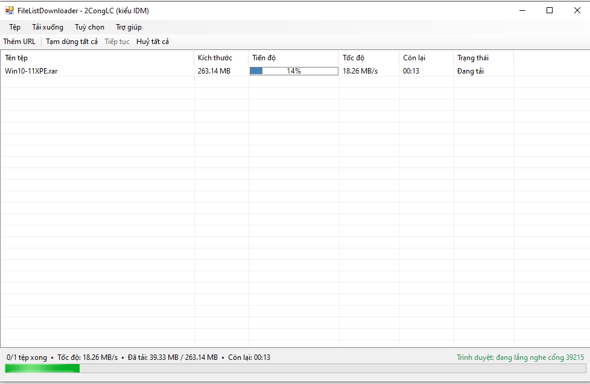

# FileListDownloader (kiểu IDM)


<p align="center">
  
</p>

Công cụ Windows Forms (VB.NET, build bằng `vbc.exe`, không cần Visual Studio) tải tệp hàng loạt
theo phong cách **Internet Download Manager**: cửa sổ chính LÀ bảng danh sách tải (như IDM thật),
menu/toolbar chỉ để thao tác phụ trợ.

## Giao diện chính

- **Menu**: Tệp (Thêm URL, Tạo danh sách từ thư mục, Tải theo danh sách có sẵn, Thoát) /
  Tải xuống (Tạm dừng tất cả, Tiếp tục, Huỷ tất cả) / Tuỳ chọn (Cài đặt) / Trợ giúp.
- **Toolbar**: Thêm URL, Tạm dừng tất cả, Tiếp tục, Huỷ tất cả - thao tác nhanh không cần vào menu.
- **Lưới** (chiếm gần trọn cửa sổ): Tên tệp / Kích thước / Tiến độ (thanh mini) / Tốc độ / Còn lại / Trạng thái.
  Chuột phải vào 1 dòng để Tạm dừng / Tiếp tục / Huỷ RIÊNG dòng đó, mở thư mục chứa, hoặc sao chép URL.
- **Thanh trạng thái** dưới cùng: tổng số tệp xong, tốc độ tổng, dung lượng đã tải, thời gian còn lại,
  và trạng thái kết nối trình duyệt (góc phải).

## 3 cách đưa link vào hàng đợi

1. **Thêm URL** (toolbar hoặc menu Tệp) - dán 1 hoặc nhiều link, chọn thư mục lưu, tải ngay lập tức.
   Đây là cách nhanh nhất, không cần tạo tệp danh sách trước - **giống hệt nút "Add URL" của IDM**.
2. **Tạo danh sách từ thư mục... / Tải theo danh sách có sẵn...** (menu Tệp) - dùng khi cần quét cả
   một thư mục nguồn để sinh URL hàng loạt rồi tải lại theo đúng cấu trúc thư mục đó.
3. **Nhận link trực tiếp từ trình duyệt** (Chrome/Edge) qua extension đi kèm ở thư mục
   `BrowserExtension/` - chuột phải vào 1 link trên web (hoặc bật tự động bắt mọi lượt tải trong
   popup extension) là link được đẩy thẳng vào hàng đợi để tải đa luồng. Bật/tắt và đổi cổng kết nối
   trong menu **Tuỳ chọn → Cài đặt**. Xem `BrowserExtension/README.md` để cài extension.

Cả 3 cách trên đều đổ vào **CÙNG MỘT hàng đợi** hiển thị trên lưới (giống IDM chỉ có một danh sách
tải duy nhất) - không còn khái niệm "dự án" riêng biệt như bản trước.

## Cơ chế tải (không đổi so với bản trước)

- Mỗi tệp được tải bằng **nhiều kết nối song song** (mặc định 4 luồng/tệp, chỉnh trong Cài đặt) nếu
  server hỗ trợ HTTP Range - đây chính là cách IDM tăng tốc độ tải từng tệp.
- **Nhiều tệp tải cùng lúc** (mặc định 3 tệp song song, chỉnh trong Cài đặt).
- Tiến độ (kể cả vị trí từng đoạn/segment đang dở) được lưu định kỳ ra `temp\queue.txt`, nên
  **tắt chương trình rồi mở lại vẫn thấy đúng danh sách và tiếp tục đúng chỗ** (bấm "Tiếp tục").
- **Thu nhỏ xuống khay hệ thống** - việc tải vẫn chạy nền, double-click icon khay để mở lại.
- Cài đặt (số luồng, số tệp song song, thư mục mặc định, bật/tắt + cổng nhận link trình duyệt)
  được lưu ở `temp\settings.txt`, tự nạp lại ở lần chạy sau.

## Kiến trúc

| Tệp | Vai trò |
|---|---|
| `FileDownloadData.vb` | Bóc tách URL → đường dẫn tương đối/tên tệp cục bộ. |
| `FileListBuilder.vb` | Quét thư mục nguồn, sinh danh sách URL, lưu ra `.txt`. |
| `DownloadItem.vb` | `DownloadStatus` enum, `DownloadSegment` (1 đoạn tải), `DownloadItem` (1 tệp cần tải, gồm nhiều segment). |
| `FileDownloader.vb` | Engine tải **một** tệp: dò dung lượng/hỗ trợ Range, chia segment, tải song song bằng nhiều `Thread`. |
| `HlsDownloader.vb` | Engine tải stream HLS (`.m3u8`): chọn chất lượng cao nhất, tải + ghép nối các đoạn `.ts`. Chỉ hỗ trợ stream không mã hoá. |
| `DownloadQueueManager.vb` | Điều phối **hàng đợi**: N tệp tải cùng lúc, Tạm dừng/Tiếp tục/Huỷ toàn bộ hoặc từng dòng, thêm tệp mới vào hàng đợi đang chạy. |
| `DownloadQueueState.vb` | Lưu/khôi phục hàng đợi (1 tệp `temp\queue.txt` duy nhất cho toàn bộ danh sách), kèm vị trí từng segment. |
| `BrowserBridgeServer.vb` | Máy chủ HTTP nội bộ (`HttpListener`, chỉ nghe `127.0.0.1`) nhận URL do extension trình duyệt gửi tới. |
| `AddUrlDialog.vb` | Hộp thoại "Thêm URL". |
| `CreateListDialog.vb` | Hộp thoại "Tạo danh sách liên kết từ thư mục". |
| `DownloadFromListDialog.vb` | Hộp thoại "Tải theo danh sách có sẵn". |
| `SettingsDialog.vb` | Hộp thoại "Cài đặt". |
| `BrowserDownloadPromptDialog.vb` | Hộp thoại xác nhận khi nhận link thủ công từ trình duyệt; cũng chứa hàm lấy thư mục Downloads thật của Windows. |
| `Form1.vb` | Cửa sổ chính: menu, toolbar, lưới (owner-draw), thanh trạng thái, khay hệ thống. |
| `Program.vb` | Điểm vào chương trình (`Main`). |
| `BrowserExtension/` | Extension Chrome/Edge (Manifest V3) gửi link tải sang app qua `BrowserBridgeServer`. |

## Cấu trúc thư mục

```
IDManager/
├── src/            <- toàn bộ mã nguồn .vb
├── bin/            <- IDManager.exe sau khi build (tự tạo, không commit)
│   ├── temp/       <- settings.txt, queue.txt (tự tạo lúc chạy)
│   └── data/       <- danh sách liên kết .txt (tự tạo lúc chạy)
├── BrowserExtension/
└── build.bat
```

## Build

Chạy `build.bat` ở thư mục gốc (tự dò `vbc.exe` của .NET Framework 4.x trong
`%WINDIR%\Microsoft.NET\Framework[64]\`, biên dịch mã nguồn trong `src\`, xuất ra `bin\IDManager.exe`).
Không cần Visual Studio.

## Ghi chú / giới hạn đã biết

- `HttpWebRequest.AddRange` trên .NET Framework 4.x chỉ có overload kiểu `Integer` (32-bit), nên với
  **đoạn tải vượt quá 2 GB** chương trình sẽ không set được Range chính xác cho phần vượt quá đó
  (tự động rơi về tải không Range cho đoạn đó). Vì tệp được chia nhỏ thành nhiều segment nên trong
  đa số trường hợp thực tế điều này không xảy ra.
- Nếu server không trả `Content-Length` hoặc không hỗ trợ Range request, chương trình tự động rơi
  về tải 1 luồng duy nhất cho tệp đó.
- "Số tệp tải song song" và "Số luồng/tệp" áp dụng khi TẠO PHIÊN MỚI (hàng đợi đang rỗng/chưa chạy);
  đổi trong lúc đang tải sẽ chỉ có hiệu lực từ lần Tạm dừng → Tiếp tục kế tiếp.
